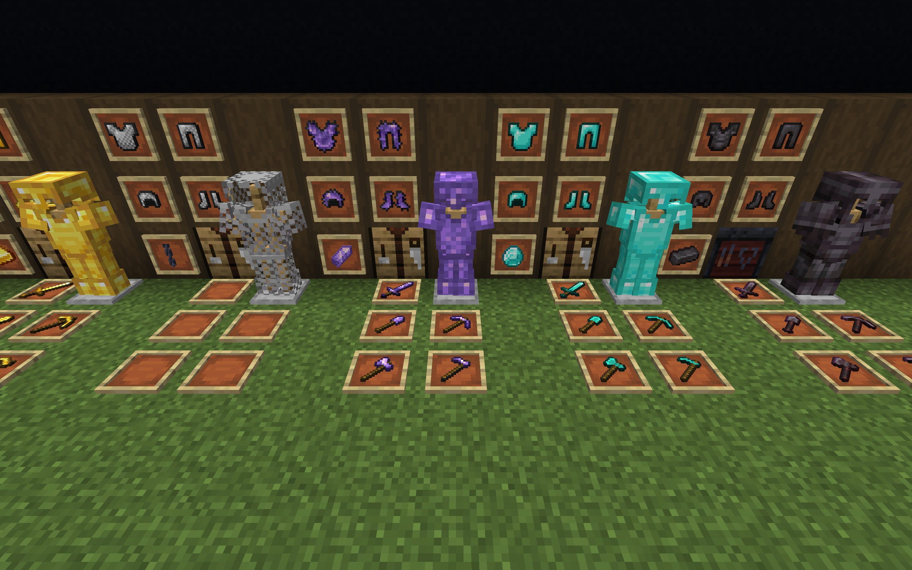

# Amethyst Armor and Tools Datapack + Resource Pack

## About
A simple datapack + resource pack that adds amethyst armor and tools to vanilla minecraft.

- No Optifine is required
- No base-game armor or tools are replaced
- Any added item can be crafted with the normal crafting table
- All armor related sounds have english subtitle support 

## Credit
- The resource pack uses a modified version of [Godlander](https://github.com/Godlander)'s [lessfancypants](https://github.com/Godlander/lessfancypants) resource pack, using edits from a [pull request](https://github.com/Godlander/lessfancypants/pull/1) created by [vadim-soude](https://github.com/vadim-soude) to display the custom armor models.
- The item models for the armor are inspired by [m2cs](https://www.planetminecraft.com/member/m2cs/)'s [copper and amethyst gear](https://www.planetminecraft.com/data-pack/copper-and-amethyst-gear/) resource pack
- The item models for the tools are inspired by [TecKillA](https://www.planetminecraft.com/member/teckilla/)'s [Amethyst Tools Data Pack](https://www.9minecraft.net/amethyst-tools-data-pack/)
- All other functions, advancements, and recipes are created by me
